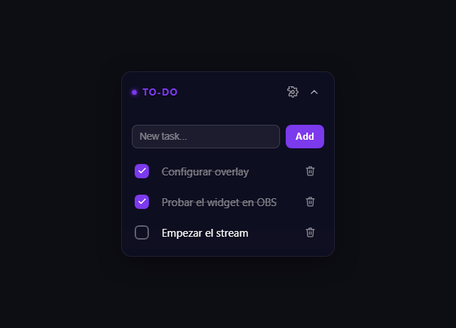

# ✅ To-Do Widget para StreamElements

Un checklist simple para tu overlay de stream. Agregá tareas, marcalas como
completadas y eliminalas, todo desde una lista prolija que tu audiencia puede
ver en pantalla mientras streameás.

No hace falta saber programar para instalarlo: son unos pocos pasos de
copiar y pegar dentro del editor de StreamElements. Más abajo tenés la guía
completa.

- 🌐 **Español e inglés incluidos** — cambiá el idioma de toda la interfaz
  con un clic, sin reinstalar nada.
- 🎨 Colores, tamaño de fuente y fondo personalizables desde el panel de
  configuración.

## 🔒 Seguridad y transparencia

Este widget está pensado para que lo instales con confianza:

- **No se conecta a internet.** No hace llamadas a servidores externos, no
  hay APIs de terceros ni servicios ocultos: todo el código corre en tu
  propio navegador.
- **No recolecta datos.** No hay analytics, no hay tracking, no hay
  publicidad. Nadie más que vos ve tus tareas.
- **Tus tareas quedan guardadas solo en tu cuenta.** El widget usa el
  almacenamiento propio de StreamElements (`SE_API.store`) para guardar la
  lista, de la misma forma en que StreamElements guarda el resto de tus
  configuraciones.
- **Es de código abierto.** Todo lo que hace el widget está en los archivos
  de este repositorio (`widget.html`, `widget.css`, `widget.js`). Podés
  revisarlo línea por línea antes de instalarlo, o pedirle a alguien de
  confianza que lo revise por vos.

## 📦 Qué incluye este repositorio

| Archivo | Para qué sirve |
| --- | --- |
| `widget.html` | La estructura del widget. Se pega en la pestaña **HTML**. |
| `widget.css` | El diseño y los estilos visuales. Se pega en la pestaña **CSS**. |
| `widget.js` | La lógica que hace funcionar el checklist. Se pega en la pestaña **JS**. |
| `fields.json` | Las opciones configurables (título, colores, tamaño de fuente) que StreamElements muestra en la pestaña **Fields**. |
| `preview.html` | Una versión de prueba para ver el widget funcionando en cualquier navegador, sin necesidad de StreamElements. |

## 🧪 Probarlo antes de instalar

Si querés ver cómo funciona antes de meterte en StreamElements:

1. Abrí el archivo `preview.html` haciendo doble click (se abre en tu
   navegador).
2. Escribí una tarea en el campo de texto y presioná **Agregar** (o Enter).
3. Marcá el casillero de una tarea para tacharla como completada.
4. Usá el ícono de tacho para eliminarla.
5. Recargá la página: la lista sigue ahí, porque queda guardada en tu
   navegador.
6. Hacé click en el ícono de engranaje (⚙) del encabezado para abrir el
   panel de configuración: podés cambiar el idioma (Español/English), el
   color y la opacidad del fondo, el color del botón "Agregar", el color del
   texto y el tamaño de la letra. Los cambios se ven al instante y quedan
   guardados.

## 🚀 Instalarlo en StreamElements

1. En el editor de overlays de StreamElements, andá a **Add Widget →
   Static/Custom → Custom Widget**.
2. Abrí el widget recién creado para editarlo y pegá el contenido de cada
   archivo en la pestaña que corresponde:
   - `widget.html` → pestaña **HTML**
   - `widget.css` → pestaña **CSS**
   - `widget.js` → pestaña **JS**
3. En la pestaña **Fields**, cambiá a la vista de editor JSON (ícono `</>`)
   y pegá el contenido de `fields.json`. Guardá y volvé a la vista normal:
   ahí vas a poder ajustar el título y los colores desde controles visuales
   si preferís no tocar el código.
4. Guardá el widget y agregalo a tu escena en OBS (o el software que uses)
   como fuente de navegador.

## 🎮 Usarlo durante el stream

- Para agregar, marcar o eliminar tareas mientras estás en vivo, hacé click
  derecho sobre la fuente de navegador en OBS y elegí **Interact**.
- Tus tareas se guardan automáticamente con el sistema de almacenamiento de
  StreamElements, así que van a seguir ahí aunque recargues la fuente o
  reinicies OBS.

## 📄 Licencia

Este widget es **gratuito** y de código abierto. Podés usarlo y modificarlo
libremente, pero **no está permitido venderlo ni cobrar por él**. Si te
resulta útil, se agradece (aunque no es obligatorio) que menciones o
recomiendes este repositorio. Los detalles completos están en
[LICENSE.md](LICENSE.md).
